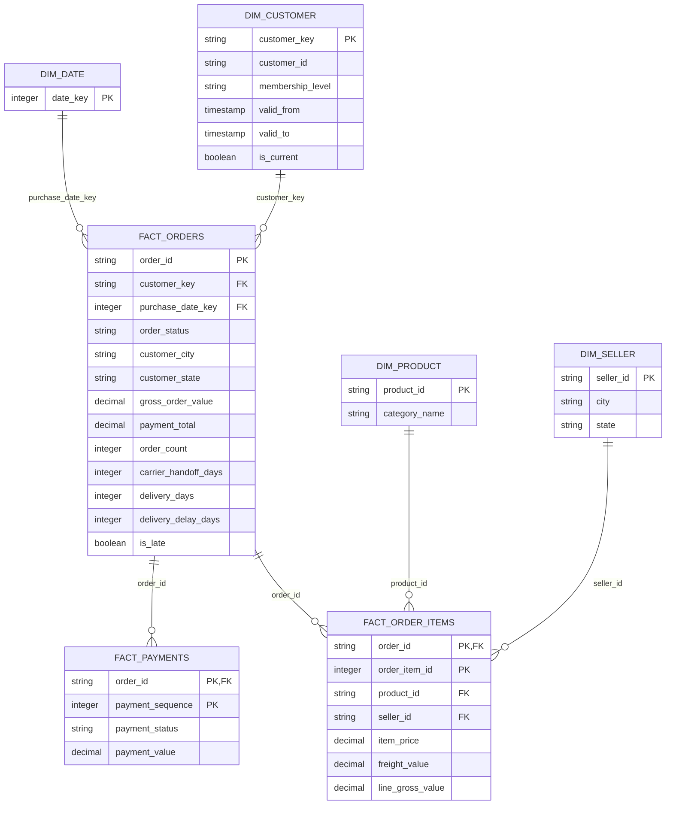

# 데이터 변환 흐름: Source → Data Lake → Data Warehouse

> 상태: Reference
> 기준 문서: [PRD v1.7](../../PRD_v1.7.md), [Phase 3](../phases/phase-03-incremental-ingestion.md), [Phase 4](../phases/phase-04-airflow-orchestration.md), [Phase 5](../phases/phase-05-dbt-duckdb-modeling.md)

이 문서는 하나의 주문 레코드가 PostgreSQL 원천에서 DuckDB Mart에 도달할 때까지 이름, 타입, 값, Grain이 어느 지점에서 왜 바뀌는지를 정리한다. 각 변환의 근거와, 그 변환을 다른 지점에서 했을 때 무엇이 깨지는지를 함께 기록한다.

## 1. 전체 흐름

```text
PostgreSQL commerce_source          OLTP 원천
        ↓ Phase 3 ingest_table()    이름 보존, 기술 컬럼만 추가
SeaweedFS bronze/*.parquet          Data Lake (불변 Object)
        ↓ Phase 3 sync_bronze_catalog()
DuckDB control.bronze_files         Commit된 Object 목록
        ↓ Phase 5 dbt staging       이름·값 변환이 일어나는 유일한 지점
DuckDB staging.*                    분석 Naming (View)
        ↓ Phase 5 dbt intermediate  Join과 사전 집계
DuckDB intermediate.*               (View)
        ↓ Phase 5 dbt marts         Star Schema
DuckDB dimensions.* / facts.*       Data Warehouse (Table / Incremental)
```

각 구간의 책임은 겹치지 않는다.

| 구간                   | 이름     | 타입       | 값         | Grain    | 근거                                             |
| ---------------------- | -------- | ---------- | ---------- | -------- | ------------------------------------------------ |
| Source → Bronze        | 보존     | 고정       | 보존       | 보존     | 원천 무손실 복제로 재수집 없는 Replay를 보장한다 |
| Bronze → Catalog       | 보존     | 보존       | 보존       | 보존     | COMMITTED Object 목록만 전달한다                 |
| Catalog → Staging      | **변환** | **정규화** | **표준화** | 보존     | 분석 Naming으로 바꾸는 단일 지점이다             |
| Staging → Intermediate | 보존     | 보존       | 보존       | **변경** | Join과 사전 집계로 Grain을 맞춘다                |
| Intermediate → Mart    | 보존     | 보존       | 보존       | 확정     | 문서화된 Grain과 Unique Key로 고정한다           |

이름 변환이 Staging 한 곳에만 있는 것이 이 설계의 핵심이다. 근거는 6절에서 다룬다.

---

## 2. 계층별 저장 형태

| 계층      | 저장소                       | 물리 형태      | 변경 가능성             | 조회 주체                          |
| --------- | ---------------------------- | -------------- | ----------------------- | ---------------------------------- |
| Source    | PostgreSQL `commerce_source` | Row 지향 Table | Mutable (UPDATE)        | Generator, Ingestion Extract       |
| Data Lake | SeaweedFS (S3 호환)          | Parquet Object | Immutable (Append Only) | Ingestion Commit, dbt Source Macro |
| Catalog   | DuckDB `control`             | Table          | 매 DagRun 재동기화      | dbt Source Macro                   |
| Warehouse | DuckDB `staging`~`marts`     | View / Table   | Incremental 교체        | 분석가, BI                         |

Source가 Mutable이고 Lake가 Immutable인 것이 계층을 나누는 근본 이유다. 원천의 `UPDATE`는 이전 값을 지우지만, Lake는 Batch마다 새 Object를 쌓으므로 과거 상태가 남는다. 이 차이가 SCD2를 가능하게 한다.

---

## 3. Source → Bronze: 이름을 바꾸지 않는 구간

Phase 3 `ingest_table()`이 담당한다. `src/ingestion/tables.py`의 `TableConfig.source_columns`가 계약이다.

### 3.1 이 구간에서 하는 일

| 작업           | 내용                                                                       |
| -------------- | -------------------------------------------------------------------------- |
| 증분 추출      | Table별 Cursor 컬럼 기준 Keyset Pagination (`customers`는 `created_at`, `customer_memberships`는 `updated_at` 등 Table마다 다르다) |
| Type 고정      | PostgreSQL 타입을 Arrow 타입으로 명시 변환                                 |
| 기술 컬럼 추가 | `_batch_id`, `_run_id`, `_ingested_at`, `_source_table`, `_schema_version` |
| 검증과 격리    | 계약 위반 Row를 Quarantine으로 분리                                        |
| Commit         | Manifest와 Checksum 기록 후 `bronze_objects`에 COMMITTED 기록              |

### 3.2 Type 변환 표

이름은 그대로지만 타입은 Arrow로 고정한다.

| PostgreSQL 타입 | Arrow 타입                  | 근거                                                                              |
| --------------- | --------------------------- | --------------------------------------------------------------------------------- |
| `VARCHAR(n)`    | `string`                    | Parquet에 길이 제약이 없다. 길이 검증은 Source CHECK 제약이 이미 수행했다         |
| `CHAR(2)`       | `string`                    | 고정 길이 Padding을 제거해 비교를 단순하게 만든다                                 |
| `INTEGER`       | `int32`                     | 원천 범위를 그대로 유지한다                                                       |
| `NUMERIC(14,2)` | `decimal128(14,2)`          | 금액이다. `float`로 바꾸면 합계에 오차가 생겨 `gross_order_value` 검증이 실패한다 |
| `TIMESTAMPTZ`   | `timestamp("us", tz="UTC")` | 모든 시각을 UTC microsecond로 통일한다                                            |

`NUMERIC` → `decimal128` 유지가 중요하다. `price`, `freight_value`, `payment_value`를 `float64`로 저장하면 `SUM()` 결과가 Full Refresh와 Incremental 사이에서 미세하게 달라지고, Logical Hash 비교(`P5-31`)가 재현 불가능해진다.

### 3.3 추가되는 기술 컬럼

| 컬럼              | 타입                 | 값                             | 용도                                                        |
| ----------------- | -------------------- | ------------------------------ | ----------------------------------------------------------- |
| `_batch_id`       | `string`             | `{dag_id}__{YYYYMMDDTHHMMSSZ}` | 같은 Batch의 7개 Table을 묶는다. Current 선택 Tie-breaker다 |
| `_run_id`         | `string`             | Pipeline Run UUID              | 실행 추적용이다                                             |
| `_ingested_at`    | `timestamp[us, UTC]` | Bronze 기록 시각               | Current 선택 Tie-breaker다                                  |
| `_source_table`   | `string`             | 원천 Table 이름                | Object 자체로 출처를 식별한다                               |
| `_schema_version` | `int32`              | `1`                            | 지원하지 않는 Version을 dbt 이전에 차단한다                 |

`_batch_id`와 `_ingested_at`은 Staging에서 **보존해야 한다**. 같은 `customer_id`가 여러 Batch에 걸쳐 여러 Version으로 존재할 때, 어느 Row가 최신인지 판정하는 유일한 근거이기 때문이다.

### 3.4 Object 배치

```text
bronze/{source_table}/ingestion_date={YYYY-MM-DD}/batch_id={batch_id}/data.parquet
bronze/{source_table}/ingestion_date={YYYY-MM-DD}/batch_id={batch_id}/manifest.json
```

`ingestion_date`는 수집일이지 비즈니스 이벤트일이 아니다. Late Arrival 주문은 과거 `order_purchase_timestamp`를 가지지만 오늘 `ingestion_date` 아래에 저장된다. 이 분리가 Late Arrival 처리의 전제다.

### 3.5 왜 여기서 이름을 바꾸지 않는가

Bronze가 원천의 무손실 복제여야 하는 이유는 세 가지다.

1. **Replay**: 장애 복구 시 Source를 다시 읽지 않고 Commit된 Bronze만 재적용한다. 이름이 바뀌어 있으면 원천과 대조 검증이 불가능하다.
2. **Schema 진화**: 원천에 컬럼이 추가되면 Bronze는 그대로 받고, Staging Mapping만 고치면 된다. Bronze에서 이름을 바꾸면 과거 Object와 신규 Object의 Schema가 갈라진다.
3. **감사**: 분석 결과가 이상할 때 Bronze Parquet를 열어 원천 값과 1:1로 비교할 수 있어야 한다.

---

## 4. Bronze → Catalog: 목록만 전달하는 구간

Phase 3 `sync_bronze_catalog()`가 담당하고, Phase 4 `warehouse_pipeline_dag`의 `sync_bronze_catalog_task`가 호출한다.

```text
pipeline_metadata.bronze_objects (status = 'COMMITTED')
        ↓
DuckDB control.bronze_files
```

| 동작 | 내용                                                                       |
| ---- | -------------------------------------------------------------------------- |
| 필터 | `status = 'COMMITTED'`인 Object만                                          |
| 방식 | `DELETE` 후 전체 `INSERT`를 한 Transaction으로                             |
| 검증 | 각 Entry의 `schema_version`을 `assert_supported_schema_version()`으로 확인 |

### 4.1 왜 S3 Prefix Glob을 쓰지 않는가

dbt가 `read_parquet('s3://bronze/orders/**/*.parquet')`로 읽으면 다음이 섞여 들어온다.

| 위험                  | 결과                                           |
| --------------------- | ---------------------------------------------- |
| 쓰다 만 Object        | Commit 실패로 남은 부분 파일을 분석에 포함한다 |
| Orphan Object         | Metadata에 없는 Object를 읽는다                |
| 미지원 Schema Version | 차단 없이 dbt Model이 깨진다                   |

Metadata를 Source of Truth로 두면 Commit Protocol이 보장한 Object만 dbt에 노출된다. 이것이 Phase 5 `P5-02` Macro가 명시적 Object 목록을 받는 이유다.

---

## 5. Catalog → Staging: 이름과 값이 바뀌는 유일한 구간

여기서 4종류의 변환이 일어난다. 각각의 근거는 아래에 나눠 정리한다.

| 변환 종류             | 대상                                                 | 근거 요약                                  |
| --------------------- | ---------------------------------------------------- | ------------------------------------------ |
| Table Prefix 제거     | 9개 컬럼                                             | 소속이 이미 Table 이름에 있다              |
| Timestamp 접미사 통일 | 5개 컬럼                                             | 이름이 타입을 속인다                       |
| Business Key 교체     | `customer_id` / `customer_unique_id`                 | 원천 PK가 사람을 식별하지 않는다           |
| 상태값 표준화         | `order_status`, `payment_status`, `membership_level` | 원천 상태를 분석용 표기 규칙으로 통일한다 |

### 5.1 Table Prefix 제거

| PostgreSQL                            | Bronze                  | Staging         | 근거                            |
| ------------------------------------- | ----------------------- | --------------- | ------------------------------- |
| `customers.customer_city`             | `customer_city`         | `city`          | Table 이름이 이미 소속을 말한다 |
| `customers.customer_state`            | `customer_state`        | `state`         | 위와 같다                       |
| `sellers.seller_city`                 | `seller_city`           | `city`          | 위와 같다                       |
| `sellers.seller_state`                | `seller_state`          | `state`         | 위와 같다                       |
| `products.product_category_name`      | `product_category_name` | `category_name` | 위와 같다                       |
| `products.product_weight_g`           | `product_weight_g`      | `weight_g`      | 위와 같다                       |
| `products.product_length_cm`          | `product_length_cm`     | `length_cm`     | 위와 같다                       |
| `products.product_height_cm`          | `product_height_cm`     | `height_cm`     | 위와 같다                       |
| `products.product_width_cm`           | `product_width_cm`      | `width_cm`      | 위와 같다                       |
| `order_payments.payment_installments` | `payment_installments`  | `installments`  | 위와 같다                       |

Olist 원본이 CSV였기 때문에 생긴 접두사다. 여러 CSV를 한 곳에 합칠 때 이름 충돌을 막으려면 접두사가 필요하지만, Table로 분리된 이후에는 중복이다.

Join할 때의 차이가 명확하다.

```sql
-- 접두사를 남기면 alias와 접두사가 이중으로 붙는다
SELECT c.customer_city, s.seller_city FROM ... c JOIN ... s

-- 제거하면 alias만으로 구분된다
SELECT c.city, s.city FROM ... c JOIN ... s
```

### 5.2 Timestamp 접미사 통일

PostgreSQL `orders`의 실제 정의다.

| PostgreSQL 컬럼                 | PostgreSQL 타입 | 접미사       | Staging                 | 근거                          |
| ------------------------------- | --------------- | ------------ | ----------------------- | ----------------------------- |
| `order_purchase_timestamp`      | `TIMESTAMPTZ`   | `_timestamp` | `purchase_at`           | 접미사 3종이 혼재한다         |
| `order_approved_at`             | `TIMESTAMPTZ`   | `_at`        | `approved_at`           | 위와 같다                     |
| `order_delivered_carrier_date`  | `TIMESTAMPTZ`   | `_date`      | `carrier_at`            | 타입은 시각인데 이름은 날짜다 |
| `order_delivered_customer_date` | `TIMESTAMPTZ`   | `_date`      | `delivered_at`          | 위와 같다                     |
| `order_estimated_delivery_date` | `TIMESTAMPTZ`   | `_date`      | `estimated_delivery_at` | 위와 같다                     |

5개 컬럼의 타입은 모두 `TIMESTAMPTZ`인데 접미사는 `_timestamp`, `_at`, `_date` 3종이다.

실제 `orders` 데이터를 보면 `order_delivered_carrier_date`와
`order_delivered_customer_date`에는 날짜뿐 아니라 배송 인계·완료 시각도 들어 있다. 따라서
`_date` 접미사만으로 `DATE` 타입으로 축소하면 시각 성분과 같은 날 안의 이벤트 순서를 잃는다.
두 컬럼은 `TIMESTAMPTZ`로 보존하고, Staging에서 실제 타입을 드러내는 `carrier_at`,
`delivered_at`으로 이름을 바꾼다. `order_estimated_delivery_date`의 자정 값은 5.2.1에서 별도로
검토하지만, 현재 원천 계약에서는 같은 방식으로 `TIMESTAMPTZ`를 유지한다.

`_date`가 특히 위험하다. 이름을 믿은 분석가는 이렇게 쓴다.

```sql
-- 시각 성분 때문에 0건이 나온다. 에러는 없다
WHERE order_delivered_carrier_date = DATE '2026-09-08'
```

`_at`으로 통일하면 "이건 시점이므로 범위 비교가 필요하다"가 이름에서 드러난다. 이 결함은 Olist 원본 CSV에서 물려받은 것이라 원천에서는 고칠 수 없다. Raw 호환 계약을 지켜야 하기 때문이다. Staging이 고치는 유일한 지점이다.

#### 5.2.1 `order_estimated_delivery_date`의 자정 값 검토

`order_estimated_delivery_date`의 시간 성분이 모두 `00:00:00`인 것은 날짜 전용 값일 가능성을
시사한다. 그러나 현재 Source 계약은 이 컬럼을 `TIMESTAMPTZ`로 정의하고 Bronze는 원천 타입을
그대로 보존한다. 따라서 Source/Bronze의 타입과 Staging 이름은 각각 `TIMESTAMPTZ`와
`estimated_delivery_at`을 유지한다.

일별 분석이 필요하면 원본 시각을 바꾸지 않고 Staging 이후에 UTC 기준 날짜를 파생한다.

```sql
CAST(estimated_delivery_at AT TIME ZONE 'UTC' AS DATE) AS estimated_delivery_date
```

향후 이 컬럼을 `DATE`로 바꾸려면 Source와 Bronze의 Breaking Change가 되므로 Schema Version 증가,
Migration/Backfill 범위, 날짜 기준 시간대를 ADR로 먼저 확정해야 한다. 현재 계약에는 이 변경을
포함하지 않는다.

### 5.3 Business Key 교체

가장 위험하고 가장 중요한 변환이다. PostgreSQL 실제 DDL은 다음과 같다.

```sql
CREATE TABLE customers (
    customer_id        VARCHAR(64) PRIMARY KEY,   -- 주문마다 새로 발급된다
    customer_unique_id VARCHAR(64) NOT NULL,      -- 사람 1명당 1개다
    ...
);
CREATE TABLE orders (
    customer_id VARCHAR(64) REFERENCES customers (customer_id)
);
```

Staging에서 두 이름을 맞바꾼다.

| PostgreSQL           | 실제 의미         | Staging              | 근거                                                  |
| -------------------- | ----------------- | -------------------- | ----------------------------------------------------- |
| `customer_id`        | 주문-고객 결합 키 | `source_customer_id` | 사람이 아니므로 `customer_id`라는 이름을 쓰면 안 된다 |
| `customer_unique_id` | 사람 식별자       | `customer_id`        | 분석에서 "고객"은 사람을 뜻한다                       |

이름을 그대로 두면 분석이 조용히 틀린다.

```sql
-- 원천 이름 그대로: 재구매 고객이 항상 0명이다
SELECT customer_id, COUNT(*) FROM orders
GROUP BY customer_id HAVING COUNT(*) > 1
```

`customer_id`가 주문마다 새로 생기므로 `COUNT(*)`는 항상 1이다. 결과는 빈 집합이고, 에러는 발생하지 않는다. 재구매율, LTV, 코호트 분석이 모두 같은 방식으로 틀린다.

교체 이후에는 의도대로 동작한다.

```sql
SELECT customer_id, COUNT(*) FROM facts.fact_orders
GROUP BY customer_id HAVING COUNT(*) > 1
```

**대가**: `stg_orders`는 `customer_id`를 직접 얻지 못한다. 원천 `orders.customer_id`는 결합 키일 뿐이므로, 사람 ID를 얻으려면 `stg_customers_current`를 `source_customer_id`로 Join해야 한다.

**SCD2와의 연결**: `dim_customer`의 Business Key도 이 교체된 `customer_id`다. 한 사람의 `membership_level` 변경 이력을 추적하려면 사람 단위 키여야 한다. 결합 키로 SCD2를 만들면 Version이 항상 1개씩 생겨 이력 추적이 무의미해진다.

### 5.4 사람 단위 집계

`customers`는 계정 불변 테이블이므로 `created_at`, `_ingested_at`, `_batch_id`로 같은 계정의
Current Bronze 행만 고른다. `stg_customers_current`는 모든 `source_customer_id`마다 한 행을
유지하며 해당 계정의 `city`·`state`를 주문 배송지 스냅샷으로 전달한다. 분석 고객 키는
`customer_unique_id`이고, 사람 단위 등급 이력은 별도 `customer_memberships` 관측에서 만든다.

<!--  -->### 5.5 나머지 이름 변환

| PostgreSQL           | Staging            | 근거                                                                                                    |
| -------------------- | ------------------ | ------------------------------------------------------------------------------------------------------- |
| `payment_sequential` | `payment_sequence` | 값은 1, 2, 3인 순번(명사)인데 이름은 형용사다. `WHERE payment_sequential = 1`은 "순차적인 = 1"로 읽힌다 |

### 5.6 상태값 표준화

PostgreSQL DDL의 CHECK 제약이 허용하는 값이 원천 Domain이다.

```sql
order_status IN ('created','approved','processing','invoiced',
                 'shipped','delivered','canceled','unavailable')
payment_status IN ('pending','completed','failed','refunded')
membership_level IN ('bronze','silver','gold')
```

Staging은 원천 8개 주문 상태를 축약하지 않고, 대문자 `order_status`로 표준화해 보존한다.

- order

  | 원천 값       | `order_status` | 근거                                      |
  | ------------- | -------------- | ----------------------------------------- |
  | `created`     | `CREATED`      | 주문 생성 직후다                          |
  | `approved`    | `APPROVED`     | 결제 승인이다                             |
  | `processing`  | `PROCESSING`   | 배송 전 세부 운영 상태다                  |
  | `invoiced`    | `INVOICED`     | 송장 발행 상태다                          |
  | `shipped`     | `SHIPPED`      | 발송이다                                  |
  | `delivered`   | `DELIVERED`    | 배송 완료다. 기본 GMV 기준이다            |
  | `canceled`    | `CANCELED`     | 취소다                                    |
  | `unavailable` | `UNAVAILABLE`  | 재고 부재로 주문을 이행할 수 없는 상태다  |

- payment

  | 원천 값     | Staging 값  |
  | ----------- | ----------- |
  | `pending`   | `PENDING`   |
  | `completed` | `COMPLETED` |
  | `failed`    | `FAILED`    |
  | `refunded`  | `REFUNDED`  |

**왜 대문자인가**: 소문자는 원천 값, 대문자는 Staging 표준 상태다. Model에서 `= 'delivered'`를 보면 원천을 직접 참조하는 실수이고, `= 'DELIVERED'`면 Staging 이후다. 규칙이 눈에 보이므로 리뷰에서 잡을 수 있다.

**왜 세부 상태를 보존하는가**: `PROCESSING`과 `INVOICED`, `CANCELED`와 `UNAVAILABLE`은 운영 원인이 다르다. `order_status`에 8개 상태를 보존하면 송장 발행 후 배송 지연, 재고 부재 취소율 같은 분석을 Staging 이후에도 수행할 수 있다. Bronze는 감사·Replay용 원본이고, 세부 운영 분석의 유일한 경로가 되어서는 안 된다.

**분석 그룹은 언제 만드는가**: 기본 GMV처럼 `order_status = 'DELIVERED'`만 필요한 지표에는 그룹이 필요 없다. "배송 전"처럼 여러 상태를 묶는 집계가 여러 Model이나 대시보드에서 반복될 때만 dbt Macro 또는 Mapping Seed로 조건을 재사용한다. 이 규칙은 집계 시점에 적용하며, `order_status_group` 컬럼을 Staging이나 Fact에 저장하지 않는다.

### 5.7 바뀌지 않는 것

| 컬럼                                      | 유지 근거                                                             |
| ----------------------------------------- | --------------------------------------------------------------------- |
| `order_id`, `product_id`, `seller_id`     | 접두사가 곧 엔티티 이름이다. 제거하면 `id`가 되어 Join에서 모호해진다 |
| `price`, `freight_value`, `payment_value` | 접두사가 없고 이미 명사다                                             |
| `order_item_id`                           | `(order_id, order_item_id)` 복합 PK의 일부다. 원천 Grain을 유지한다   |
| `payment_type`                            | 접두사가 의미를 가진다. `type`만으로는 무엇의 종류인지 알 수 없다     |
| `_batch_id`, `_ingested_at`               | Current 선택과 SCD2 정렬 Tie-breaker가 사용한다                       |

---

## 6. 왜 변환을 Staging에서만 하는가

이름 변환의 위치를 다르게 잡으면 각각 다른 방식으로 깨진다.

| 변환 위치                 | 깨지는 것                                                                     |
| ------------------------- | ----------------------------------------------------------------------------- |
| Source (원천 컬럼명 변경) | Olist Raw 호환 계약 위반이다. Seed 재적재가 불가능해진다                      |
| Bronze (수집 시 Rename)   | 원천 대조 검증이 불가능하다. Replay가 깨진다. 과거 Object와 Schema가 갈라진다 |
| **Staging**               | **깨지지 않는다. Bronze는 원본을 보존하고, Rename은 한 곳에만 있다**          |
| Intermediate 이후         | 같은 Rename이 Model마다 흩어진다. 한쪽만 고치면 불일치가 생긴다               |

Phase 5 문서의 "Intermediate/Mart는 Raw Source Prefix를 직접 참조하지 않는다" 계약이 이 규칙을 강제하고, AC-19가 검증한다.

---

## 7. Staging → Intermediate: Grain을 맞추는 구간

이름은 바뀌지 않는다. 바뀌는 것은 Grain이다.

| Model                         | 입력 Grain        | 출력 Grain       | 목적                                |
| ----------------------------- | ----------------- | ---------------- | ----------------------------------- |
| `int_orders_enriched`         | 주문 1행          | 주문 1행         | 고객 정보를 Join한다                |
| `int_order_items_enriched`    | 주문 Line 1행     | 주문 Line 1행    | 상품·판매자 정보를 Join한다         |
| `int_payment_summary`         | 결제 Sequence 1행 | **주문 1행**     | 주문 단위로 사전 집계한다           |
| `int_customer_history`        | 고객 관측 1행     | 고객 Version 1행 | SCD2 구간을 만든다                  |
| `int_affected_business_dates` | 변경 Key          | Business Date    | Late Arrival 재계산 범위를 계산한다 |

### 7.1 왜 사전 집계가 필요한가

`fact_orders`는 Item 합계와 Payment 합계를 함께 가진다. 두 Grain을 직접 Join하면 Fan-out이 발생한다.

```sql
-- 잘못된 방식: Item 3행 × Payment 2행 = 6행이 되어 양쪽 합계가 부풀려진다
SELECT o.order_id, SUM(i.price), SUM(p.payment_value)
FROM orders o JOIN order_items i USING (order_id)
              JOIN order_payments p USING (order_id)
GROUP BY o.order_id
```

Item 3행, Payment 2행인 주문에서 Join 결과는 6행이 된다. `SUM(i.price)`는 실제의 2배, `SUM(p.payment_value)`는 3배가 된다.

올바른 방식은 각각을 먼저 주문 Grain으로 접은 뒤 1:1로 Join하는 것이다.

```text
int_order_items_enriched  → 주문 Grain 집계 ┐
                                            ├→ fact_orders (1:1 Join)
int_payment_summary       → 주문 Grain 집계 ┘
```

이것이 Phase 5 "Item과 Payment를 각각 주문 Grain으로 집계한 뒤 `fact_orders`에 Join한다" 계약의 근거다.

---

## 8. Intermediate → Mart: Grain을 확정하는 구간

| Model              | Grain             | Unique Key                     | Materialization        |
| ------------------ | ----------------- | ------------------------------ | ---------------------- |
| `dim_customer`     | 고객 Version 1행  | `customer_key`                 | table 또는 incremental |
| `dim_product`      | 상품 1행          | `product_id`                   | table 또는 incremental |
| `dim_seller`       | 판매자 1행        | `seller_id`                    | table 또는 incremental |
| `dim_date`         | UTC Date 1행      | `date_key`                     | table                  |
| `fact_orders`      | 주문 1행          | `order_id`                     | incremental            |
| `fact_order_items` | 주문 Line 1행     | `(order_id, order_item_id)`    | incremental            |
| `fact_payments`    | 결제 Sequence 1행 | `(order_id, payment_sequence)` | incremental            |

### 8.1 Warehouse Mart ERD

아래 ERD는 Intermediate Model이 아닌, 분석가와 BI가 조회하는 Warehouse Mart의 관계를 나타낸다. `fact_orders`가 주문 중심 Fact이고, 주문 Line과 결제 Sequence Fact는 `order_id`로 주문에 연결된다. 고객은 주문 시점의 SCD2 Version인 `customer_key`로 연결한다. `city`/`state`는 [Membership Grain 분리](membership-grain-separation.md) 이후 고객 속성이 아니라 주문 시점 배송지 스냅샷이므로 `dim_customer`가 아닌 `fact_orders`에 `customer_city`/`customer_state`로 존재한다(`int_orders_enriched`에서 Join). 배송 Measure도 `fact_orders`에 있다. 배송 Timestamp가 주문 1건당 각 1개이므로 Delivery Grain은 주문 Grain과 같고, 1:1 `fact_delivery`를 따로 두지 않는다.



| 관계                                              | 연결 기준                  | 설계상 의미                                                                                                                 |
| ------------------------------------------------- | -------------------------- | --------------------------------------------------------------------------------------------------------------------------- |
| `dim_customer` → `fact_orders`                    | `customer_key`             | `purchase_at`이 `[valid_from, valid_to)`에 드는 고객 Version을 연결한다. 현재 고객 정보로 과거 주문을 다시 해석하지 않는다. |
| `dim_date` → `fact_orders`                        | 주문의 구매 Business Date  | Late Arrival도 수집일이 아닌 구매일에 속한다.                                                                               |
| `fact_orders` → `fact_order_items`                | `order_id`                 | 주문 1건은 여러 주문 Line을 가질 수 있다.                                                                                   |
| `fact_orders` → `fact_payments`                   | `order_id`                 | 주문 1건은 여러 결제 Sequence를 가질 수 있다.                                                                               |
| `dim_product` / `dim_seller` → `fact_order_items` | `product_id` / `seller_id` | 상품과 판매자는 주문 Line Grain에서 분석한다.                                                                               |

`fact_order_items`와 `fact_payments`는 서로 직접 Join하지 않는다. 두 Fact의 Grain이 다르므로, 주문 단위 합계는 각각을 `order_id` Grain으로 집계한 뒤 `fact_orders`에 반영한다.

`dim_customer.customer_key`는 `customer_id`(자연키)를 그대로 PK로 쓰지 않고 별도 Surrogate Key로
만든다. SCD2 구조상 같은 `customer_id`가 `membership_level` Version마다 여러 행으로 존재해
자연키가 이 Table 안에서 유일하지 않기 때문이다. `customer_key = md5(customer_id || valid_from
|| attribute_hash)`로 만들어(`dim_customer.sql`) 같은 고객의 같은 속성 상태는 재계산해도 항상
같은 Key 값이 나오게 한다(재현성, `uuid()` 같은 비결정적 값은 쓰지 않는다). 이 Key가
`fact_orders.customer_key`의 FK 대상이며, 구매 시점에 유효했던 정확한 Version 하나를 가리킨다.

### 8.2 Fact 컬럼 사전

각 Fact의 컬럼이 어떤 값을 담는지, 그 값이 어디에서 오는지를 정리한다. 출처 표기는 다음과 같다.

| 표기          | 의미                                                                |
| ------------- | ------------------------------------------------------------------- |
| Degenerate    | Dimension을 만들지 않고 Fact에 직접 두는 식별자·서술 값이다        |
| FK            | Dimension을 가리키는 외래 키다                                     |
| Measure       | 집계 대상 수치다                                                    |
| Snapshot      | 이벤트 발생 시점의 값을 Fact에 고정한다. 이후 원천이 바뀌어도 변하지 않는다 |

#### `fact_orders`

한 행은 하나의 주문이다.

| 컬럼                   | 타입        | 역할       | 담는 값과 출처                                                                                                       |
| ---------------------- | ----------- | ---------- | -------------------------------------------------------------------------------------------------------------------- |
| `order_id`             | `string`    | PK         | 주문 식별자다. 원천 `orders.order_id`를 그대로 쓴다                                                                  |
| `customer_key`         | `string`    | FK         | 구매 시점에 유효했던 `dim_customer` Version이다. `purchase_at` 기준 Temporal Join으로 얻는다. 현재 Version이 아니다  |
| `purchase_date_key`    | `integer`   | FK         | `purchase_at`의 UTC 날짜를 가리키는 `dim_date` 키다. 수집일이 아니라 구매일이다                                      |
| `order_status`         | `string`    | Degenerate | Staging에서 대문자로 표준화한 8개 운영 상태 중 하나다. 기본 GMV는 `'DELIVERED'`로 거른다                             |
| `customer_city`        | `string`    | Snapshot   | 주문 시점 배송지 도시다. `stg_customers_current`를 `int_orders_enriched`에서 Join해 얻는다. 고객 속성이 아니다       |
| `customer_state`       | `string`    | Snapshot   | 주문 시점 배송지 주다. 출처는 `customer_city`와 같다                                                                 |
| `gross_order_value`    | `decimal`   | Measure    | 주문 상품 금액과 운임의 합이다. 고객이 지불하기로 한 주문 금액이다                                                   |
| `payment_total`        | `decimal`   | Measure    | 해당 주문에 기록된 모든 결제 Sequence 금액의 합이다. 할부·환불·실패 때문에 `gross_order_value`와 다를 수 있다        |
| `order_count`          | `integer`   | Measure    | 항상 `1`이다. 주문 건수를 `COUNT(*)` 없이 `SUM()`으로 세게 해 다른 Measure와 집계 방식을 통일한다                    |
| `carrier_handoff_days` | `integer`   | Measure    | 구매부터 배송사 인계까지 걸린 일수다. `carrier_at`이 `NULL`이면 `NULL`이다                                           |
| `delivery_days`        | `integer`   | Measure    | 구매부터 고객 수령까지 걸린 일수다. 실제 리드타임이다. 미배송 주문은 `NULL`이다                                      |
| `delivery_delay_days`  | `integer`   | Measure    | 약속 도착일 대비 실제 도착일의 차이다. 조기 배송이면 음수다                                                          |
| `is_late`              | `boolean`   | Measure    | 약속일보다 늦게 도착했는지 여부다. 미배송 주문은 `NULL`이며 지연으로 세지 않는다                                     |

#### `fact_order_items`

한 행은 하나의 주문에 포함된 하나의 주문 상품이다.

| 컬럼               | 타입      | 역할       | 담는 값과 출처                                                                              |
| ------------------ | --------- | ---------- | ------------------------------------------------------------------------------------------- |
| `order_id`         | `string`  | PK, FK     | 이 주문 상품이 속한 주문이다. `fact_orders`로 연결된다                                      |
| `order_item_id`    | `integer` | PK         | 주문 안에서의 Line 순번이다. 주문마다 1부터 시작하므로 단독으로는 고유하지 않다              |
| `product_id`       | `string`  | FK         | 판매된 상품이다. `dim_product`로 연결된다                                                   |
| `seller_id`        | `string`  | FK         | 이 Line을 판매한 판매자다. 주문 1건에 여러 판매자가 섞일 수 있으므로 주문이 아닌 Line 속성이다 |
| `item_price`       | `decimal` | Measure    | 이 Line의 상품 금액이다. 운임을 포함하지 않는다                                             |
| `freight_value`    | `decimal` | Measure    | 이 Line에 배분된 운임이다                                                                   |
| `line_gross_value` | `decimal` | Measure    | `item_price + freight_value`다. 이 Line이 주문 금액에 기여하는 총액이다                     |

#### `fact_payments`

한 행은 하나의 주문에 대한 하나의 결제 시도다.

| 컬럼               | 타입      | 역할       | 담는 값과 출처                                                                                           |
| ------------------ | --------- | ---------- | -------------------------------------------------------------------------------------------------------- |
| `order_id`         | `string`  | PK, FK     | 이 결제가 속한 주문이다                                                                                  |
| `payment_sequence` | `integer` | PK         | 주문 안에서의 결제 순번이다. 원천 `payment_sequential`을 Staging에서 이름만 바꾼 값이다                  |
| `payment_status`   | `string`  | Degenerate | 대문자로 표준화한 결제 상태다. 환불·실패 분석의 유일한 근거다                                            |
| `payment_value`    | `decimal` | Measure    | 이 결제 Sequence의 금액이다. 주문 단위 합계는 `fact_orders.payment_total`이며 여기서 중복 계산하지 않는다 |

### 8.3 Measure 계산 계약

```text
fact_order_items:
  item_price       = price
  freight_value    = freight_value
  line_gross_value = item_price + freight_value

fact_orders:
  item_subtotal     = SUM(item.price)
  freight_total     = SUM(item.freight_value)
  gross_order_value = item_subtotal + freight_total
  payment_total     = SUM(payment.payment_value)
  order_count       = 1

fact_orders (Delivery):
  carrier_handoff_days = carrier_at   - purchase_at            (일)
  delivery_days        = delivered_at - purchase_at            (일)
  delivery_delay_days  = delivered_at - estimated_delivery_at  (일)
  is_late              = delivered_at > estimated_delivery_at
```

`gross_order_value`와 `payment_total`은 의미가 다르므로 같은 것으로 취급하지 않는다. 주문 금액과 실제 결제 금액은 할부, 환불, 실패로 인해 달라진다. 기본 Sales와 GMV는 `order_status = 'DELIVERED'`인 `gross_order_value`다.

Delivery Measure 4개는 Non-additive다. `SUM()` 대상이 아니라 평균·분위수·비율로만 집계한다. 원천 Timestamp가 `NULL`인 주문은 해당 Measure도 `NULL`이므로, 정시 배송률과 평균 리드타임의 분모는 `delivered_at IS NOT NULL`인 주문이다. 미배송 주문을 `0`으로 채우면 리드타임이 짧아지고 지연율이 낮아지는 방향으로 조용히 왜곡된다.

---

## 9. SCD2: Mutable 원천을 이력으로 바꾸는 구간

PostgreSQL `customer_memberships`는 `UPDATE`로 덮어쓰므로 과거 `membership_level`이 남지 않는다. Bronze는 Batch마다 새 Object를 쌓으므로 관측 이력이 보존된다. 이 차이를 이용해 `dim_customer`가 Version 이력을 복원한다.

```text
PostgreSQL customer_memberships UPDATE로 현재 값만 존재한다
        ↓ Batch마다 수집
Bronze Object 여러 개          Batch별 관측이 누적된다
        ↓ 관측을 시간 순으로 정렬
int_customer_history          Version 구간을 만든다
        ↓
dim_customer                  [valid_from, valid_to) 구간을 가진다
```

### 9.1 추적 속성

| 속성               | 원천 컬럼                    | 근거                         |
| ------------------ | ---------------------------- | ---------------------------- |
| `membership_level` | `customer_memberships.membership_level` | 등급 변경 시점을 알아야 한다 |

등급 Hash가 바뀔 때만 새 Version을 만든다. `updated_at`만 바뀌고 등급이 그대로면 Version을 늘리지 않는다.

### 9.2 valid_from 결정 규칙

| Version | `valid_from` | 근거                                                                        |
| ------- | ------------ | --------------------------------------------------------------------------- |
| 최초    | `created_at` | Olist Seed에 과거 이력이 없으므로 최초 Version을 Baseline Snapshot으로 본다 |
| 이후    | `updated_at` | 실제 변경 시점이다                                                          |

최초 Version의 `valid_from`을 `updated_at`으로 잡으면, 그 이전에 발생한 주문이 유효한 Version을 찾지 못해 Unknown Customer Key가 된다. AC-12의 "정상 Unknown 0"이 실패한다.

### 9.3 Temporal Join

주문은 구매 시점에 유효했던 고객 Version을 참조한다.

```sql
order.purchase_at >= dim_customer.valid_from
AND order.purchase_at < COALESCE(dim_customer.valid_to, TIMESTAMPTZ 'infinity')
```

현재 Version을 참조하면 과거 주문의 등급이 현재 등급으로 잘못 집계된다. 예를 들어 bronze 등급일 때 산 주문이 지금 gold 등급으로 분류되어 등급별 매출 분석이 왜곡된다.

---

## 10. 한 주문의 전체 여정

`order_purchase_timestamp = 2026-09-05T10:00:00Z`인 주문 1건이 2026-09-08 Batch에 수집되는 경우다.

| 계층         | 위치                                                                                                     | 형태                                                                                                                                   |
| ------------ | -------------------------------------------------------------------------------------------------------- | -------------------------------------------------------------------------------------------------------------------------------------- |
| Source       | `commerce_source.orders`                                                                                 | `order_id='o1'`, `customer_id='c1'`, `order_status='delivered'`, `order_purchase_timestamp='2026-09-05T10:00:00Z'`                     |
| Bronze       | `bronze/orders/ingestion_date=2026-09-08/batch_id=warehouse_pipeline_dag__20260908T000000Z/data.parquet` | 위와 동일한 컬럼명 + `_batch_id`, `_ingested_at`, `_schema_version=1`                                                                  |
| Catalog      | `control.bronze_files`                                                                                   | `source_table='orders'`, `object_key='bronze/orders/...'`, `schema_version=1`                                                          |
| Staging      | `staging.stg_orders`                                                                                     | `order_id='o1'`, `source_customer_id='c1'`, `customer_id='u1'`(Join), `order_status='DELIVERED'`, `purchase_at='2026-09-05T10:00:00Z'` |
| Intermediate | `intermediate.int_orders_enriched`                                                                       | 위 + Temporal Join으로 얻은 `customer_key`                                                                                             |
| Mart         | `facts.fact_orders`                                                                                      | `order_id='o1'`, `customer_key`, `gross_order_value`, `order_status='DELIVERED'`                                                       |

`ingestion_date`는 2026-09-08이지만 `purchase_at`은 2026-09-05다. 이 분리 덕분에 Late Arrival 주문이 과거 Business Date의 Fact로 정확히 들어간다.

---

## 11. 요약

| 원칙                                       | 내용                                                  |
| ------------------------------------------ | ----------------------------------------------------- |
| Bronze는 원천을 보존한다                   | Replay, Schema 진화, 감사를 가능하게 한다             |
| 이름 변환은 Staging에서 1회만 한다         | 원본 보존과 중복 제거를 동시에 만족하는 유일한 위치다 |
| Catalog가 dbt 입력을 통제한다              | Prefix Glob은 Commit되지 않은 Object를 섞는다         |
| Grain은 Intermediate에서 맞춘다            | Fan-out 없이 Fact Measure를 계산한다                  |
| Mutable 원천은 Bronze 누적으로 이력이 된다 | SCD2와 Temporal Join의 전제다                         |

---

## 관련 문서

- [Phase 3. Incremental Ingestion](../phases/phase-03-incremental-ingestion.md) — Source에서 Bronze까지의 Commit Protocol
- [Phase 4. Airflow Orchestration](../phases/phase-04-airflow-orchestration.md) — 각 구간의 실행 경계와 Lease
- [Phase 5. dbt + DuckDB Modeling](../phases/phase-05-dbt-duckdb-modeling.md) — Staging 이후의 Model 구현
- [PRD v1.7](../../PRD_v1.7.md) — Section 7.1 상태 Mapping, Section 14 dbt Model, Section 15 SCD2
